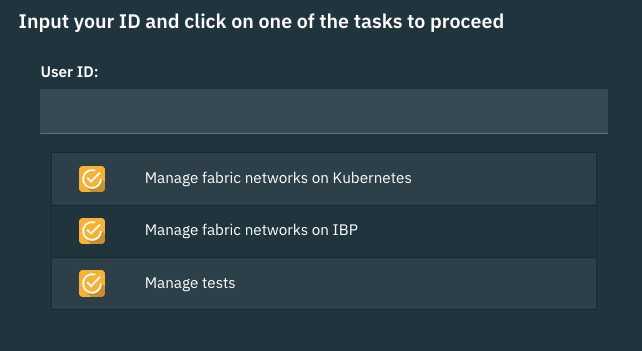
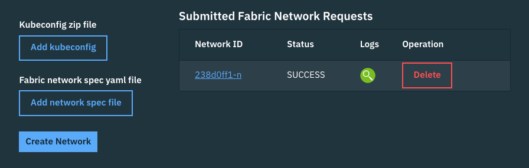
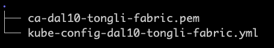
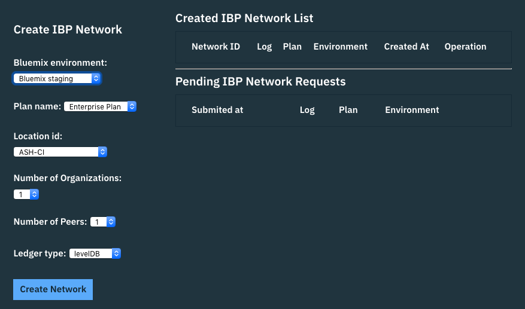
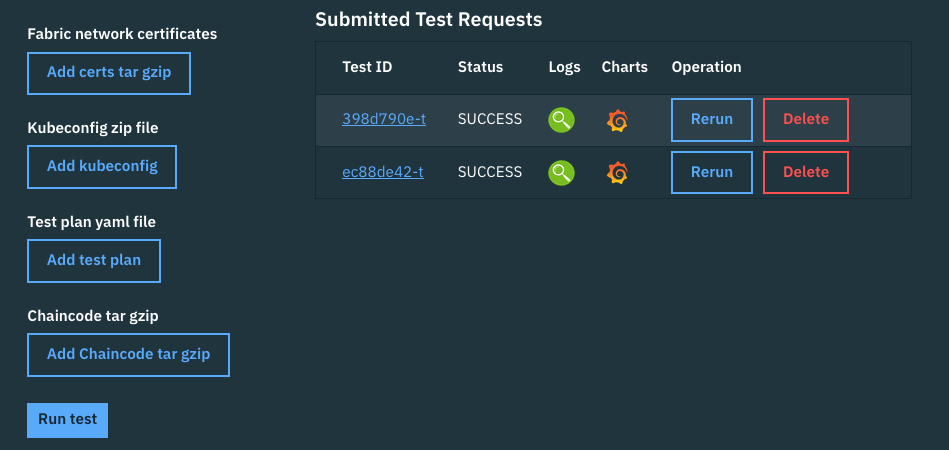
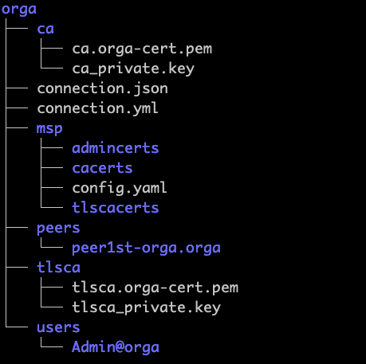
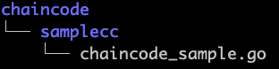
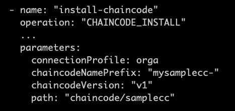

# HFRD
Hyperledger Fabric Regression Driver

This project was designed to provide fabric testers an easy way to set up fabric network and run various fabric tests.

# Setting up hfrd

HFRD server runs as a set of Docker containers. To get hfrd up running, you will need to have a Docker environment. If you do not have it, please install docker first by following its installation process. Once you have docker in place, please follow the process below.

### Prepare the setup file
Download the [hfrd setup file](setup/hfrd.sh) and the sample [hfrdconfig.xml](setup/hfrdconfig.xml) into a directory of your choice. You may place the downloaded hfrd.sh file into /usr/local/bin/hfrd, then change the permission so that it can be run anywhere.

```
chmod +x hfrd.sh
```
   
### Start hfrd
Run the following command to start up all the hfrd containers

```
./hfrd.sh start <Your_server_IP_address> <path_to_hfrdconfig.xml> <true/false>
   
    For example: ./hfrd.sh start 192.168.56.32 ./hfrdconfig.xml false
```   
This process creates a directory named hfrd in your home directory. There will be many files and directories created in this directory while your hfrd is running. The files and directories in ~/hfrd directory should not be changed manually. The process will also show you couple of urls at the end of the process. You can use these url to access hfrd rest server and jenkins server. For the example above, you should have two urls like these:

```
   http://192.168.56.32:9090   (The api server)
   http://192.168.56.32:8080   (The jenkins server)
```

The flag at the end means if the jenkins server needs to be restarted. In production env, you may not want to restart your jenkins server since it may still be running some jobs. This is very important especially when you just stopped a running instance of hfrd.

### Stop hfrd
Run the following command to stop all the hfrd containers
```
./hfrd.sh stop
```
### Restart hfrd
To restart hfrd after hfrd was stopped, run the same command which you used to start hfrd.

# Use hfrd
Once you have hfrd running, use the api server url found at the very end of starting up hfrd process to access its user interface.

### The landing screen
If you point your browser to the api server url, you should see the landing screen  

On this screen, there is one entry box and three tasks. When security is on, this id entry box will be filled automatically with your login id, when security is off, you will have to provide an ID to identify yourself. The setup process above assumed that the security plugin was off. 

The User ID box is required, it is used as a namespace to distinguish your work from others. As a tester you will have to pick a user id.  You should use a meaningful id. HFRD allows multiple users to do their work at the same time, so you should pick an ID which is obvious to other users.

If you plan to create your fabric network on an existing k8s environment, you should click on Manage fabric networks on Kubernetes. If you plan to create your fabric network on IBM starter or enterprise plan, you should click on Manage fabric networks on IBP. If you just want to run a test or see test results, you should click on Manage tests.

### Manage fabric network on kubernetes


This screen allows you to manage fabric networks on existing kubernetes clusters. On the left hand side, it asks you to provide kube configuration file and a network specification yaml file to create a fabric network. Once you provide the two files, then click on Create Network button to submit your request. Creating network will take a bit of time, typically it will take between 5 to 10 minutes for everything to finish. During this time, the right side of the screen should automatically be refreshed to reflect the current status of the process. Each requested network will be assigned a network ID, which will be made clickable after awhile, the status should change from PENDING, to INPROGRESS, to SUCCESS or FAILURE based on the eventual results. You may also click on the log button to see the log file which gets produced during the process. Eventually you can delete the fabric network by clicking on the red Delete button. You should only delete the network if you are sure you won't need that network any longer. 


#### <a name="kubeconfig-zip-file"></a>Kubeconfig zip file
The kube configuration file must be a zip file which contains your kubernetes configuration yaml file and possibly certificates. This zip file should be provided by your kubernetes service provider. If your service provider does not provide a zipped kube configuration file, then you will have to manually create this zip file. The reason why this has to be a zip file is because most of the kubernetes configuration file requires certificates. If you have to manually create this file, then the content of this zip file must include the kubernetes configuration file which should be named as kubexxx.yml and all the certificates must reside in the same directory. Here is an example. 



In this example, notice that the kube configuration file is named kube-config-dal10-tongli-fabric.yml and there is one certificate file referenced by the configuration file. If you manually create the zip file, make sure the naming convention is followed, otherwise, HFRD will not be able to figure out which is configuration file and which is the certificate file.

#### Fabric network spec yaml file
To create a fabric network, you will need to specify how you want your fabric network look like, which release of fabric network you want and how much resources that you like to allocate to each component. This must be a yaml file which strictly follow yaml format with 2 spaces indentation. Please refer to this example [network specification](docs/netspec.yml) file to create your own network specification yaml file. 

#### The artifacts created
If you click on network ID link, you will be taking to another screen which shows you some files and directories produced by the network creation process. Here are the list of the files

- uploaded kube configuration file named kubeconfig.zip
- uploaded fabric network spec file named fabricspec.yml
- produce certificate and connecction profile named certs.tgz file
- other artifacts

These files will be removed after you delete the network.

### Manage fabric network on IBP


This screen allows you to manage fabric networks in starter and enterprise plans. Simply use the drop down boxes to select IBM Bluemix environment, then select a plan, then select the items according the given options, then click on Create Network button. Then these start or enterprise network will be created on Bluemix under a configuration Bluemix account. This account has to be pre-configured when HFRD is setting.

### Manage tests


This screen allows you to manage fabric tests. On the left hand side, it asks you to provide fabric network certificates, kubeconfig file, test plan and chaincode. Once you provide all 4 of these files, you can click on Run test button to start a test run. Each submitted test request will be assigned a unique Test ID, and its status will be showing after the test request is submitted. The link to the log and chart will be available when the test starts running and when hfrd starts collecting the test metrics. The link to the log and chart won't be immediately available after the submission. Test can be removed by clicking on the red Delete button. At present, test Rerun is not implemented.

#### Fabric network certificates
When run a test, it is very important to have certificates and connection profiles of all the fabric artifacts such as peers, orderers, cas, organizations etc. Without them, the test cannot perform any fabric operations. The required certificates file must be a tar gzip file. If you used the HFRD created the fabric network, this file should have been created for you, and ready to be used for tests. If your fabric network that you are trying to run tests again was not created by using HFRD, then you will have to create this file manually. Basically you will need to get all the certificates and produce a connection profile for each org. Here is an example for the network specified by the example [network specification file](docs/netspec.yml)

network certificate directory structure and content



The above chart only showed one org named orga. Other organizations will follow exact format. The content in each directory such as admincerts, cacerts, tlscacerts, peer1st-orga.orga etc will be exactly same as what cryptogen produces. As matter of the fact, HFRD uses that tool creating all the certificates. The only difference is that HFRD also create connection profiles in both yaml and json format. 

#### Kubeconfig zip file
HFRD tests run in a kubernetes cluster. To do that you will need to provide a kubeconfig file for accessing the kubernetes cluster. Like the kubeconfig zip file you need for creating a fabric network, this zip file can be the same kubeconfig file that you used to create fabric network or a different one from a completely different kubernetes cluster. But the format, structure and the kube config file name inside [the kubeconfig zip file](#kubeconfig-zip-file) must follow what was described in that [section](#kubeconfig-zip-file)


#### Test plan yaml file
Test plan yaml file is the core of HFRD. It is a yaml file that a tester may spend most his or her time to work on. This is the file describing what operations of a fabric network should be tested. What makes HFRD revolutionary is the test plan. It completely changes how a tester produce a test, in the past, when one has to test something, the very first thing a tester needs to do is writing code. With HFRD, a test will never need to do that, testers simply need to use their favorite text editor to produce a yaml file. In that yaml file, the tester can indicate what to test, how to test. An [example test plan yaml file](docs/testplan.yml) has been provided. Please refer to the [HFRD Operation](docs/hfrd-operations.md) for details.

#### Chaincode tar gzip
To run any chain code, you will have to provide the chain code in a tar gzip file. Currently only chain code developed in go lang is supported. In the future, HFRD may support chain code written in other languages. Here is an example which shows how the go code is organized and how it get used in the test plan for chain code install operation.






HFRD will use the chain code uploaded to install the chain code onto peers
specified in chain code install operations and run the chain code in chain code invoke operations.
